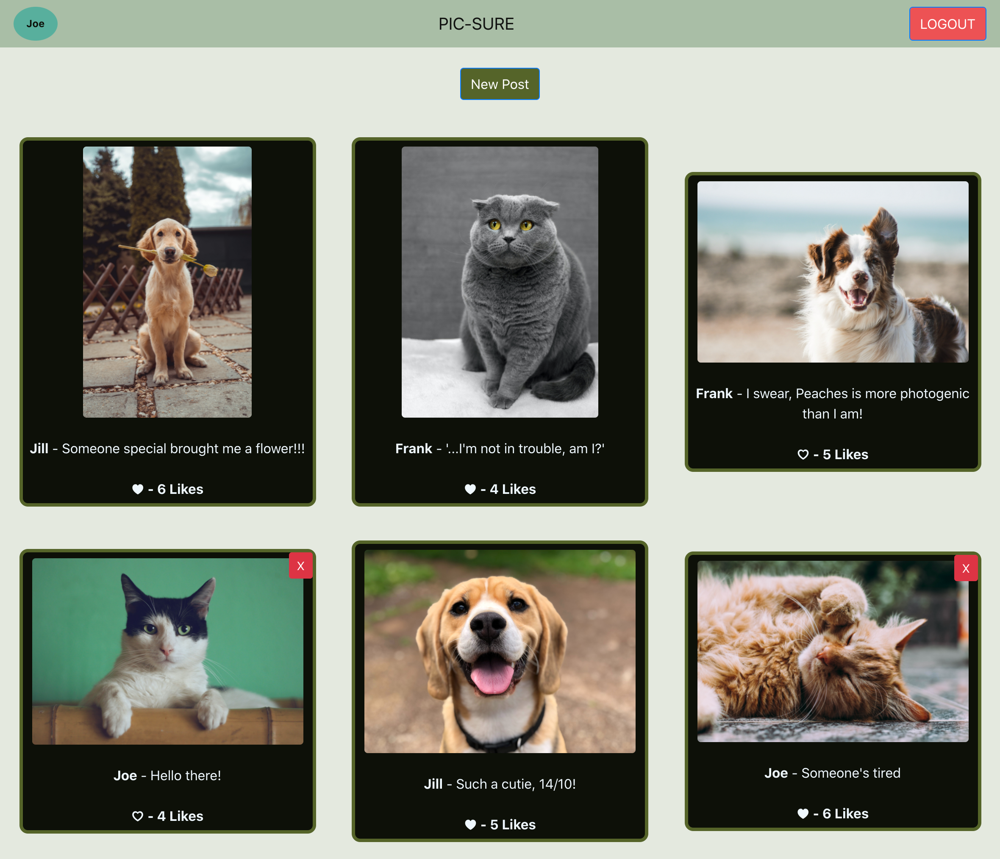

# Pic-Sure!

Pic-Sure is an image sharing single page application.
Post, like, and comment on your favorite pictures!




## Features
* Built with React and Ruby on Rails
* Features login authentication using JSON Web Tokens(JWT) for automatic login
* Image storage handled by Active Storage


## Installation

First, clone the repository. Then setup the backend and frontend.

Backend:
First, cd into the backend directory in your terminal, then run:
```
bundle install
rails db:migrate
```
This will install your gem dependencies and set up your database.

To set up user authentication, you will need to set the secret key that will be used to set and read customers' hashed JSON Web Tokens. To do this, make sure you're still in the backend directory in your terminal and run:

```
EDITOR="code --wait" rails credentials:edit 
```

*Note, If not using VS Code editor, replace "code" with editor specific prefix, i.e. "subl"*

This will open your credentials.yml file, where you can add secret keys for your app to use. These won't be visible anywhere in the code or be pushed to the repo.

Here you will add a key with the secret code of your choice. You should be using a randomly generated 256-bit key,(a hexadecimal string with 64 characters), and changing it periodically for security. It will look something like this:
'''
secret_jwt_key: 1234567890abc...
'''
Save the file and close the window and the key will be safely stored away.

Now you're ready to start up the backend server. In the terminal (still in the backend directory), enter:

```
rails s
```

This will start a rails server on http://localhost/3001

*Note, you can run rails db:seed as well to start off with some pre-seeded data.*

Frontend:
cd into frontend directory in your terminal, then run:
```
npm install
npm run
```

This will start React on http://localhost/3000, navigate here to use app


## Contributing
Pull requests are welcome. For major changes, please open an issue first to discuss what you would like to change.
Please make sure to update tests as appropriate.

## License
[MIT](https://choosealicense.com/licenses/mit/)